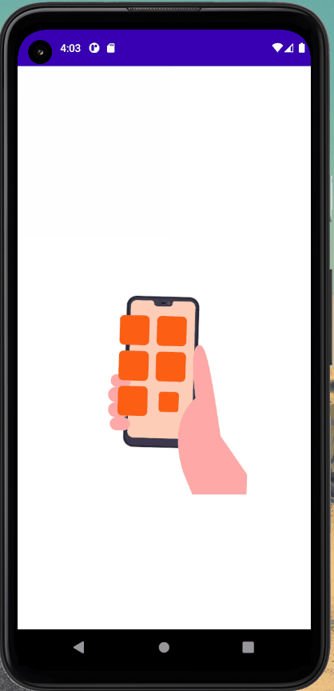
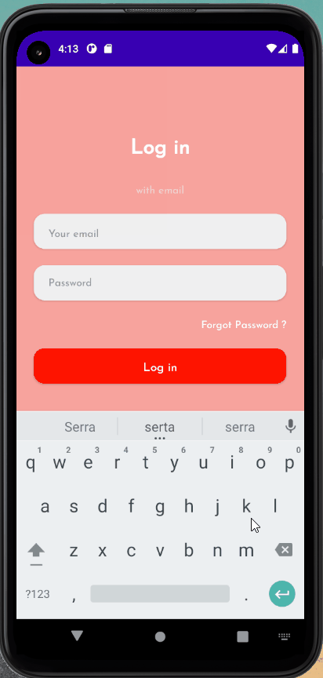
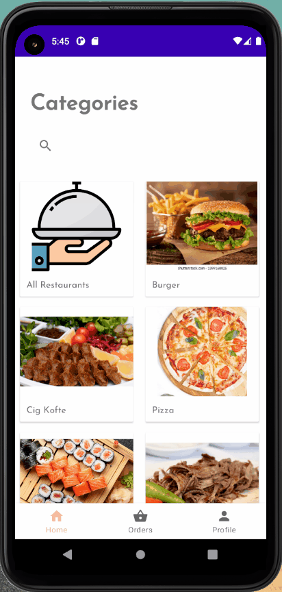

# Yemeksepeti Mobil Android Bootcamp Bitirme Ödevi
------

Bu proje Yemeksepeti, Kodkuyoruz ve Patika.dev işbirliğiyle yapılan Yemeksepeti Mobil Android Bootcamp'inin bitirme ödevidir. 

## Projede Kullanılan Teknolojiler 
------
- Mvvm
- Dagger Hilt
- Kotlin Coroutine
- ViewModel - Livedata
- Retrofit - Gson
- RecyclerView
- Fragments

### Proje Yapısı
------
- Splash Screen
- Onboarding
- Login ve Signup sayfaları
- Restaurant Listesi
- Restaurant Detayı
- Restaurant ile ilgili minimum bilgi
- Restaurantın yemek Listesi
- Yemek Detay ekranı
- Kullanıcı Profil Sayfası
- Kullanıcının verdiği siparişler

### Ekran Görüntüleri
-----

#### Splash, Onboarding, Signup
-----

#### Login, Categories, Restaurants, Meal Details
-----

#### Profile and Profile Update
-----

